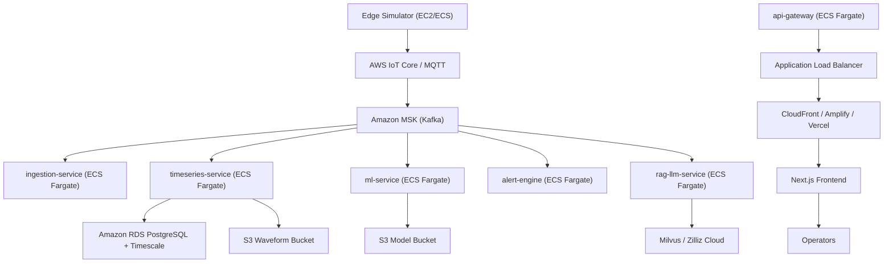

# AWS Deployment Guide – Vibration Monitoring Platform

## Overview
This document describes the infrastructure requirements and step-by-step process for deploying the full Vibration Monitoring & Predictive Maintenance stack on Amazon Web Services (AWS). It covers networking, data stores, container services, observability, and validation so you can reproduce the on-prem architecture in the cloud.

## Architecture Summary

## Component Inventory
| Layer | Path | Purpose |
| --- | --- | --- |
| Edge | `services/edge-simulator/` | Generates vibration signals and sends via HTTP/MQTT |
| Ingestion | `services/ingestion-service/` | Bridges MQTT → Kafka topics |
| Timeseries | `services/timeseries-service/` | Kafka consumer, FastAPI, writes metrics to Postgres/Timescale & waveforms to S3 |
| ML | `services/ml-service/` | Consumes metrics, runs anomaly detector, publishes inference |
| Alerts | `services/alert-engine/` | Consumes metrics/inference, persists alerts |
| RAG / LLM | `services/rag-llm-service/` | Milvus vector DB + OpenAI/Bedrock backed insight API |
| API Gateway | `services/api-gateway/` | Authentication + proxy for UI |
| Frontend | `apps/frontend/` | Next.js dashboard |
| Shared libs/models | `libs/signal_processing`, `model.joblib` | FFT utilities & trained detector |

## Runtime & Build Prerequisites
- **Python 3.10+** for all backend services; dependencies defined in each `requirements.txt`.
- **Node.js 18+** for the Next.js frontend (`apps/frontend/package.json`).
- **Docker 24+** to containerize services; **Docker Compose** optional for local tests.
- **AWS CLI v2** configured with IAM credentials; **Terraform/CDK** optional for infrastructure-as-code.
- **GitHub Actions** or **AWS CodeBuild/CodePipeline** for CI/CD.

## AWS Infrastructure Requirements
### Networking & Security
- VPC with /16 CIDR, two public and two private subnets across AZs.
- Internet Gateway for public subnets; NAT Gateway per AZ for private workloads.
- VPC endpoints (Interface/Gateway) for S3, Secrets Manager, CloudWatch Logs, ECR.
- Security Groups:
  - ALB: allow 80/443 inbound from internet.
  - ECS services: allow only ALB or peer services; outbound via NAT.
  - RDS: allow ECS + alert engine SGs.
  - MSK: allow ingestion/timeseries/ml/alert SGs.
- IAM Roles:
  - ECS task roles with least privilege (S3 buckets, Secrets Manager, MSK).
  - Deployment role for CI/CD with scoped `ecr:*`, `ecs:RegisterTaskDefinition`, `iam:PassRole`.
  - EC2 instance profile for edge simulator (SSM + secret read).

### Data & Messaging Layer
- **Amazon RDS (PostgreSQL 15)**: db.m5.large, Multi-AZ, enable Timescale extension, apply schema from `services/timeseries-service/db.py` and `services/alert-engine/main.py`.
- **Amazon S3**:
  - `vibration-waveforms` bucket for waveform JSON (`services/timeseries-service/storage.py`).
  - `vibration-models` bucket for `model.joblib`.
  - Optional `vibration-config` bucket for artifacts/backups.
- **Amazon MSK**:
  - Kafka cluster with topics `metrics`, `raw-waveform`, `inference-results` (see `KAFKA_TOPIC_*` env vars).
  - Enable TLS + IAM auth where possible.
- **MQTT**:
  - AWS IoT Core with rules that forward to MSK via Firehose, or expose the ingestion service to the MQTT broker over TLS.
- **Milvus / Vector Store**:
  - Managed Zilliz Cloud (preferred) or self-hosted Milvus on EKS/EC2 with gp3 storage. Environment keys from `services/rag-llm-service/rag.py`.

## Application Layer Deployment (ECS Fargate)
1. **Dockerfiles**: Create Dockerfiles for each service referencing respective `requirements.txt`. Include healthcheck commands and non-root user.
2. **ECR Repositories**: Create one repo per service (`vibration-ingestion`, `vibration-timeseries`, etc.). Build locally or via CI and push images.
3. **Task Definitions**: Define CPU/memory, port mappings, CloudWatch Logs, and Secrets Manager references. Suggested sizing:
   - ingestion-service: 0.5 vCPU / 1 GB
   - timeseries-service: 1 vCPU / 2 GB
   - ml-service: 1 vCPU / 2 GB
   - alert-engine: 0.5 vCPU / 1 GB
   - rag-llm-service: 1 vCPU / 2 GB
   - api-gateway: 0.5 vCPU / 1 GB
4. **ECS Services**: Run in private subnets with Service Auto Scaling (min 1, max 4 tasks). Attach to MSK via bootstrap endpoints and set env vars via Secrets Manager.
5. **Load Balancing**: Place API gateway tasks behind an Application Load Balancer with HTTPS listener (ACM cert). Other services stay internal.
6. **Edge Simulator**: Run `services/edge-simulator` either on EC2 (t3.small) or ECS task in public subnet. Configure `INGESTION_MODE` (`http` or `mqtt`) and target endpoints via Parameter Store/Secrets Manager.
7. **Frontend Hosting**:
   - AWS Amplify (CI/CD) or S3 + CloudFront (`next build && next export`).
   - Alternatively deploy on Vercel but keep API endpoints on AWS.
   - Set `NEXT_PUBLIC_API_BASE_URL` to the ALB/CloudFront URL.

## Configuration & Secrets
Centralize environment keys (from `.env.example`) in AWS Secrets Manager or Parameter Store. Key groups:
- **Kafka**: `KAFKA_BOOTSTRAP_SERVERS`, `KAFKA_TOPIC_METRICS`, `KAFKA_TOPIC_RAW`, `KAFKA_TOPIC_INFERENCE`, `ENABLE_KAFKA`.
- **Database**: `DB_HOST`, `DB_PORT`, `DB_USER`, `DB_PASSWORD`, `DB_NAME`.
- **Storage**: `MINIO_ENDPOINT` (if self-hosted), `MINIO_ACCESS_KEY`, `MINIO_SECRET_KEY`, `MINIO_BUCKET_WAVEFORMS`.
- **API Gateway**: `API_SECRET_KEY`, downstream service URLs.
- **ML/RAG**: `MODEL_S3_URI`, `MILVUS_HOST`, `MILVUS_PORT`, `LLM_API_KEY`, `LLM_BASE_URL`.
- **Simulator/MQTT**: `MQTT_BROKER_HOST`, `MQTT_BROKER_PORT`, `INGESTION_MODE`, `TIMESERIES_URL`, `ML_URL`.

Use Secrets Manager for sensitive values; load them into ECS tasks via the `secrets` section. Non-sensitive configs can live in Parameter Store.

## Observability & Operations
- Enable CloudWatch log groups per ECS service with retention (30–90 days).
- Metrics & alarms:
  - ECS CPU/memory
  - RDS CPU/storage/connection count
  - MSK broker health & consumer lag
  - ALB 4xx/5xx rates
  - S3 bucket errors
- Tracing: instrument FastAPI apps with AWS Distro for OpenTelemetry or X-Ray.
- Backups: AWS Backup plans for RDS; S3 versioning & lifecycle policies; MSK storage autoscaling.
- Disaster Recovery: document RDS snapshot restore, S3 restore, MSK cluster replacement, Milvus backups.

## Deployment Workflow
1. Clone repo and prepare `.env` locally.
2. Build Docker images for each service; run unit tests.
3. Push images to ECR and update ECS task definitions (manually or via CI/CD).
4. Deploy ECS services; verify `/health` endpoints through ALB or internal load balancers.
5. Run edge simulator to generate sample data; confirm metrics in TimescaleDB and waveforms in S3 via `services/timeseries-service/api.py`.
6. Validate alert engine, ML inference, and RAG endpoints through the API gateway.
7. Deploy frontend (Amplify/CloudFront/Vercel) pointing to the API gateway URL.

## Validation Checklist
- [ ] Kafka topics exist and consumers report healthy lag.
- [ ] Metrics inserted into `vibration_metrics` table; alerts captured in `alerts`.
- [ ] Waveforms present in S3 bucket with correct object paths (`machine_id/timestamp.json`).
- [ ] ML service publishes to `inference-results`; alert engine reacts to anomalies.
- [ ] RAG service connects to Milvus/Zilliz and returns context-based answers.
- [ ] API gateway OAuth/token exchange works; Next.js UI displays live charts.
- [ ] CloudWatch alarms and log streams confirm telemetry coverage.

## Next Steps
- Codify the infrastructure via Terraform or AWS CDK for reproducibility.
- Replace placeholder auth in `services/api-gateway/main.py` with Amazon Cognito or IAM Identity Center.
- Add automated CI/CD (GitHub Actions → ECR → ECS) and IaC pipelines to promote dev → staging → prod.

With this guide you can provision the required AWS resources, containerize each microservice, and validate the full vibration monitoring pipeline end-to-end in the cloud.

